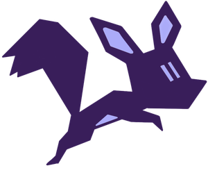

<div align="center">
  
#  Squirrel Datasets Core
  
[](https://badge.fury.io/py/squirrel-datasets-core)
[](https://badge.fury.io/py/squirrel-datasets-core)
[](https://pepy.tech/project/squirrel-datasets-core)
[](LICENSE)
[](https://squirrel-datasets-core.readthedocs.io)
[](https://merantix-momentum.com)
[](https://join.slack.com/t/squirrel-core/shared_invite/zt-14k6sk6sw-zQPHfqAI8Xq5WYd~UqgNFw)

</div>

---
# What is Squirrel Datasets Core?

`squirrel-datasets-core` is a hub where the user can 1) explore existing datasets registered in the data mesh by other users and 2) preprocess their datasets and share them with other users. As an end user, you will
be able to load many publically available datasets with ease and speed with the help of `squirrel`, or load and preprocess
your own datasets with the tools we provide here. 

For preprocessing, we currently support Spark as the main tool to carry out the task.

Please see our [documentation](https://squirrel-datasets-core.readthedocs.io) for further details.

If you have any questions or would like to contribute, join our Slack community!

# Installation
Currently, we have not released a functional version of `squirrel-core` and `squirrel-datasets-core` into the public 
pypi registry. Therefore we ask you to use the following installation method, which uses the source code directly:

First, you need to clone the `squirrel-core` and `squirrel-datasets-core` repositories by:
```shell
git clone https://github.com/merantix-momentum/squirrel-core.git
```
and 
```shell
git clone https://github.com/merantix-momentum/squirrel-datasets-core.git
```
Then you can install both packages by
```shell
pip install -e "squirrel-core[all]"
```
and
```shell
pip install -e "squirrel-datasets-core[all]"
```

In the documentation, you may also see some requirements to install the two packages first, please follow the 
instruction above, instead of installing from public pypi registry (e.g `pip install squirrel-core` or 
`pip install squirrel-datasets-core`). We kindly ask for your patience.

# Documentation

To view the docs locally, please use the following command in root directory of `squirrel-datasets-core`:
```
sphinx-build ./docs/source ./docs/build
```
The command above will create all documentation pages under `./docs/build`.
To view the start page, open `./docs/build/index.html` in your browser. 

# Contributing
Squirrel is open source and community contributions are welcome!

# The humans behind Squirrel
We are [Merantix Momentum](https://merantix-momentum.com/), a team of ~30 machine learning engineers, developing machine learning solutions for industry and research. Each project comes with its own challenges, data types and learnings, but one issue we always faced was scalable data loading, transforming and sharing. We were looking for a solution that would allow us to load the data in a fast and cost-efficient way, while keeping the flexibility to work with any possible dataset and integrate with any API. That's why we build Squirrel – and we hope you'll find it as useful as we do! By the way, [we are hiring](https://merantix-momentum.com/about#jobs)!


# Citation

If you use Squirrel Datasets in your research, please cite Squirrel using:
```bibtex
@article{2022squirrelcore,
  title={Squirrel: A Python library that enables ML teams to share, load, and transform data in a collaborative, flexible, and efficient way.},
  author={Squirrel Developer Team},
  journal={GitHub. Note: https://github.com/merantix-momentum/squirrel-core},
  year={2022}
}
```

This is a test